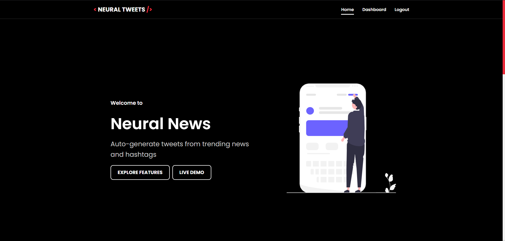
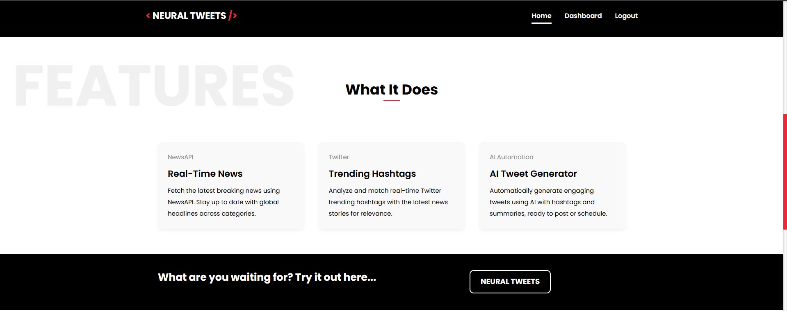
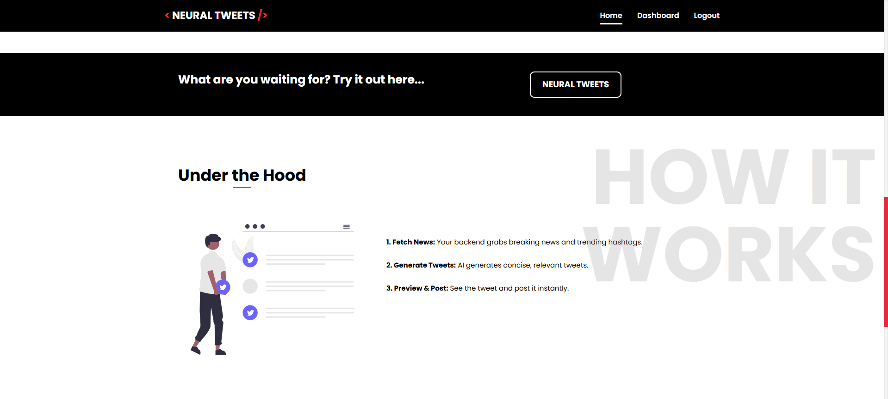
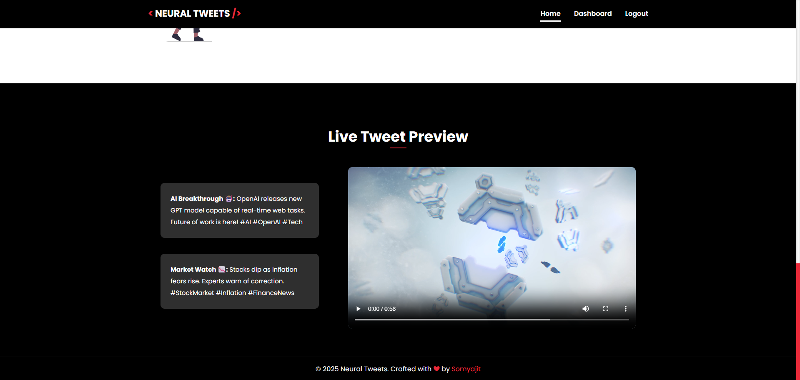
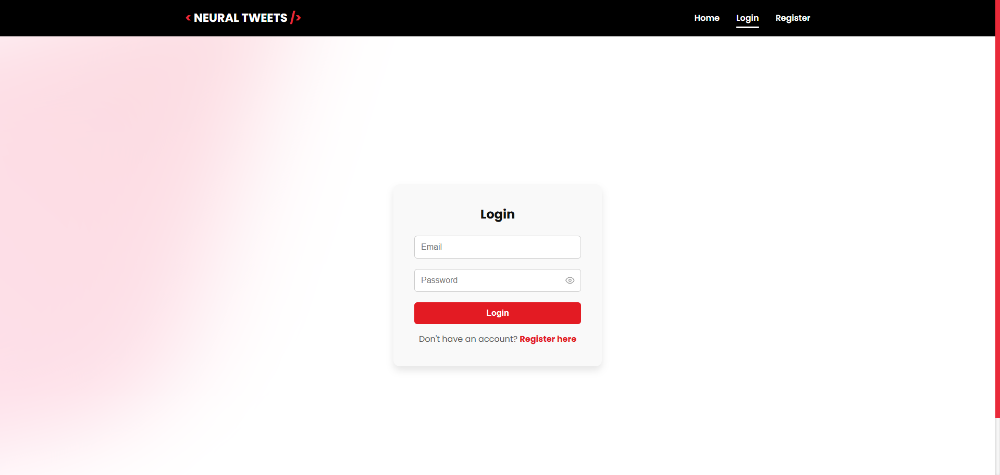
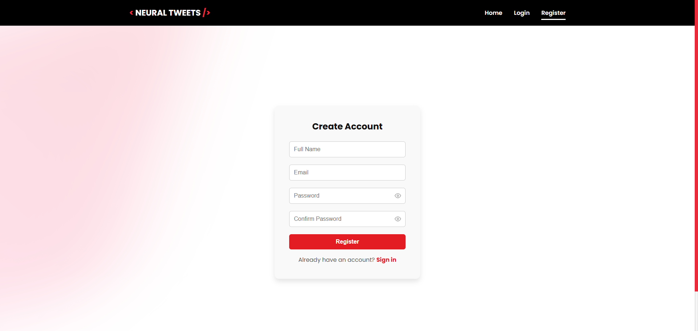
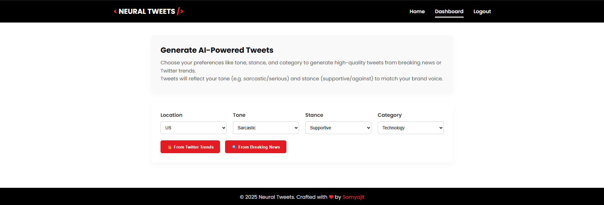
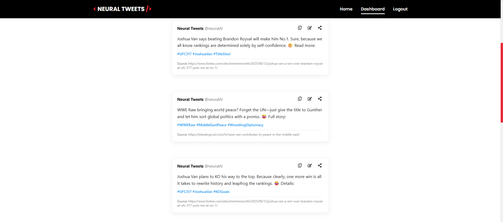

# NeuralNewsTweets

**AI-powered Tweet Generator for Verified News and Twitter Trends**

---

## Project Overview

NeuralNewsTweets is a full-stack application that enables users to generate AI-crafted tweets based on:
- Real-time news from **verified sources**
- Current **Twitter trending topics**
- Custom tone, stance, category, and location preferences

Built for content creators, journalists, and marketers, the system uses the OpenAI API to generate concise, creative tweets in seconds.

---

## Features

### AI Tweet Generation
- Based on real-time **NewsAPI** articles
- Or **Twitter trending hashtags** via RapidAPI
- Generate tweets aligned with selected **tone**, **stance**, and **topic category**

### Authentication & User Management
- Strategy-based login system:
  - Email/Password
  - Google OAuth (planned)
  - Twitter OAuth (planned)
- OTP-based email verification using **SMTP (Gmail)**
- **JWT authentication** with **refresh token** flow
- **Role-based access** (user/admin)

### Frontend
- Clean **React** frontend (no CSS frameworks used)
- Landing, Login, Register, OTP Verification, and Dashboard
- Protected routes and redirect logic based on authentication status
- Dashboard with:
  - Input controls for tweet generation
  - Display of tweets in styled cards

<video width="600" controls>
  <source src="assets/Demo.mp4" type="video/mp4">
  Your browser does not support the video tag.
</video>

---

## Technologies Used

### Backend
- **Node.js** + **Express**
- **MongoDB** (without Mongoose)
- **JWT** for secure authentication
- **Nodemailer** (Gmail SMTP) for sending OTP emails
- **OpenAI API** (Azure deployment)
- **NewsAPI** and **Twitter Trends API** (via RapidAPI)

### Frontend
- **React**
- **Axios** (with interceptors for Authorization headers)
- **React Router DOM**
- **Vanilla CSS**
- **jwt-decode** (for token decoding and route protection)

---

## API Security

- **Access Token:** Stored in `localStorage`, used to authenticate API calls via Bearer token
- **Refresh Token:** Sent to backend and validated before issuing a new access token
- **Middleware:** All protected routes on the server are guarded by:
  - **Authentication Middleware**: Verifies JWT tokens
  - **Authorization Middleware**: Validates user role (e.g., `user`, `admin`)

---

## Setup Instructions

1. Clone this Repo
2. For server setup -
2.1. Navigate to the `server/` directory, and do `npm install`.
2.2. Add a `.env` file with configs mentioned in `server/.env.example`.
2.3. Run the backend server - `npm run dev`
3. For client setup -
3.1. Navigate to the `client/` directory, and do `npm install`.
3.2. Add a `.env` file with configs mentioned in `client/.env.example` (replace your server PORT).
3.3. Run the frontend development server - `npm start`.

## Product Demo (SS)

1. Landing Page Home Section
   
  

1. Feature Section
   
   

2. Working Section
   
   

3. Demo Section
   
   

4. Login Page
   
   

5. Register Page
   
   

6. Verify OTP Page
   
   

7. Dashboard Page
  
   

8.  Tweets Part
    
    